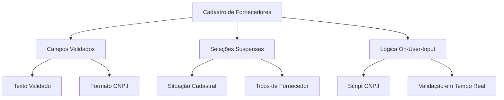
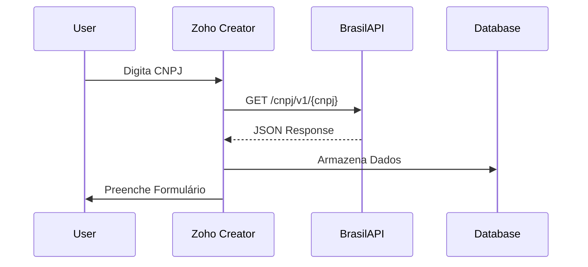
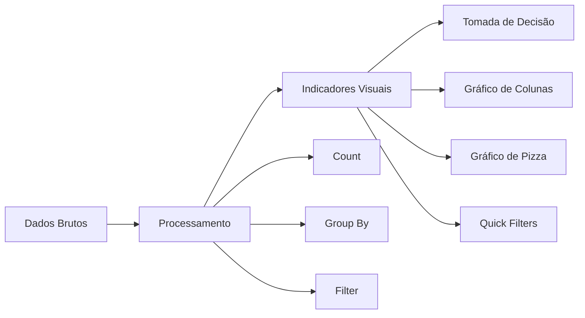
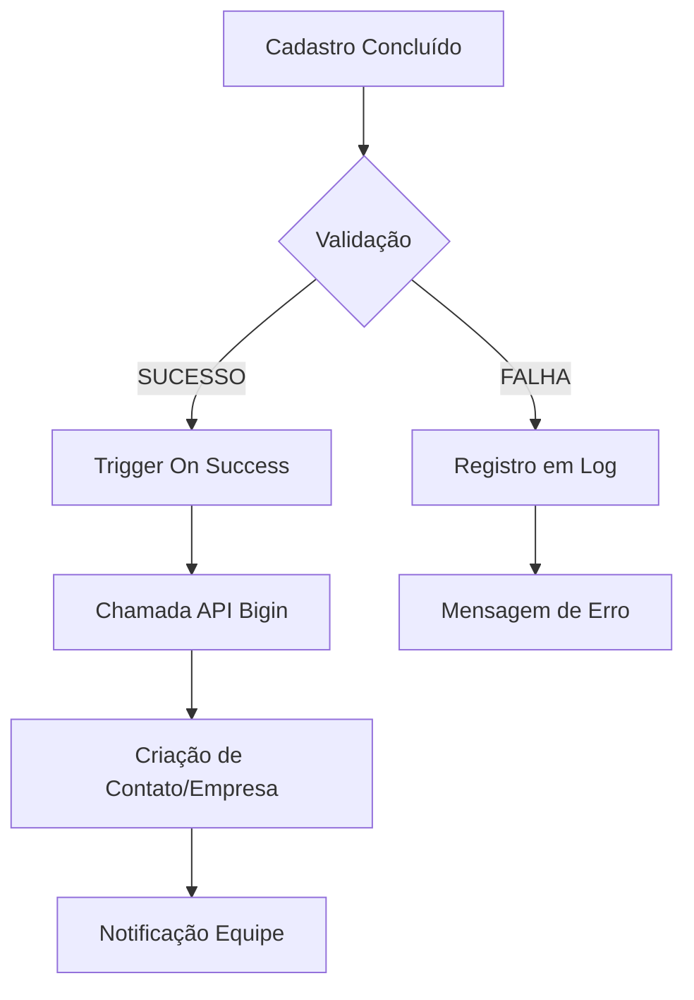

# Arquitetura de Dados — Sistema de Cadastro de Fornecedores

## Nova Gestão Ltda (Projeto com Zoho)

---

#  Visão Geral do Projeto

Este projeto foi desenvolvido para **automatizar o processo de cadastro de fornecedores**, reduzindo erros de digitação e melhorando a qualidade das informações registradas no sistema.

A solução utiliza **Zoho Creator** como plataforma principal, combinada com **Deluge Scripting** para automação de lógica de negócio e integração com APIs externas.

Uma das principais funcionalidades é a consulta automática de dados empresariais através do **CNPJ**, utilizando a **BrasilAPI**. Ao inserir o CNPJ, o sistema busca automaticamente informações públicas da empresa e preenche diversos campos do formulário.

Além disso, os dados cadastrados são integrados automaticamente com o **Zoho Bigin (CRM)**, permitindo que a equipe comercial tenha acesso imediato aos fornecedores cadastrados.

---

#  Objetivo do Sistema

Automatizar o cadastro de fornecedores garantindo:

* validação de dados em tempo real
* redução de erros manuais
* integração automática com CRM
* geração de indicadores para tomada de decisão

---

# Tecnologias Utilizadas

* Zoho Creator
* Deluge Scripting
* BrasilAPI (Integração de Dados Públicos)
* Zoho Bigin (CRM)
* ZML (Zoho Markup Language)

---

# 1. Arquitetura do Formulário

O sistema começa com um formulário estruturado para garantir que os dados sejam preenchidos corretamente.

Os campos incluem validações automáticas e lógica de preenchimento baseada na entrada do usuário.

## Campos Estruturados e Validação



Essa estrutura garante que o formulário seja **padronizado, confiável e fácil de utilizar**.

---

## Implementação Técnica

A lógica abaixo demonstra um exemplo de script executado quando o usuário insere um CNPJ no formulário.

```javascript
// Exemplo de Lógica On-User-Input em Deluge
if(input.CNPJ.length == 14) {
    // Dispara consulta à API
    response = zoho.creator.getURL("https://brasilapi.com.br/api/cnpj/v1/" + input.CNPJ);
    if(response != null) {
        // Preenche campos automaticamente
        input.razao_social = response.razao_social;
        input.logradouro = response.logradouro;
        // ... outros campos
    }
}
```

Esse mecanismo reduz o preenchimento manual e aumenta a consistência das informações cadastradas.

---

#  2. Integração com APIs Externas

Para enriquecer os dados do cadastro, o sistema realiza consultas automáticas à **BrasilAPI**, que fornece dados públicos de empresas brasileiras.

## Arquitetura de Comunicação



Esse fluxo garante que os dados inseridos no sistema sejam **validados e enriquecidos automaticamente**.

---

## Script de Integração (Deluge)

```deluge
// Função principal de integração
function integrateWithBrasilAPI() {
    cnpj = input.CNPJ;
    apiUrl = "https://brasilapi.com.br/api/cnpj/v1/" + cnpj;
    
    // Requisição HTTP
    response = zoho.creator.getURL(apiUrl);
    
    if(response != null) {
        // Parsing do JSON
        nomeFantasia = response.nome_fantasia;
        razaoSocial = response.razao_social;
        logradouro = response.logradouro;
        bairro = response.bairro;
        municipio = response.municipio;
        uf = response.uf;
        
        // Preenchimento automático
        input.nome_fantasia = nomeFantasia;
        input.razao_social = razaoSocial;
        input.logradouro = logradouro;
        input.bairro = bairro;
        input.municipio = municipio;
        input.uf = uf;
        
        // Log da operação
        insert into Log_Consultas {
            cnpj: cnpj,
            data_hora: now(),
            status: "SUCESSO",
            dados_retorno: response.toString()
        };
    } else {
        insert into Log_Consultas {
            cnpj: cnpj,
            data_hora: now(),
            status: "FALHA",
            mensagem_erro: "API não retornou dados válidos"
        };
    }
}
```

Essa integração garante que o sistema mantenha **dados atualizados e confiáveis**.

---

#  3. Relatórios e Inteligência de Dados

Após o armazenamento dos dados, o sistema disponibiliza dashboards para análise e acompanhamento dos fornecedores cadastrados.

## Dashboard Estruturado



O objetivo é transformar dados brutos em **informações úteis para tomada de decisão**.

---

## Componentes do Dashboard

```html
<!-- Exemplo de ZML para Dashboard -->
<zoho-page>
    <zoho-chart type="column" 
               title="Distribuição Geográfica"
               data-source="Fornecedores"
               x-axis="UF"
               y-axis="Count(UF)">
    </zoho-chart>
    
    <zoho-chart type="pie" 
               title="Status Cadastral"
               data-source="Fornecedores"
               x-axis="Status"
               y-axis="Count(Status)">
    </zoho-chart>
    
    <zoho-filter name="uf_filter" 
                 label="Filtrar por Estado"
                 field="UF"
                 type="dropdown">
    </zoho-filter>
</zoho-page>
```

Esses componentes permitem que gestores visualizem rapidamente informações importantes sobre os fornecedores.

---

#  4. Log de Consultas e Auditoria

Para garantir rastreabilidade e monitoramento das integrações, o sistema registra todas as consultas realizadas à API.

## Estrutura da Tabela de Log

| Campo         | Tipo       | Descrição                 |
| ------------- | ---------- | ------------------------- |
| id            | AutoNumber | ID único                  |
| cnpj          | Text       | CNPJ consultado           |
| data_hora     | DateTime   | Timestamp da consulta     |
| status        | Choice     | SUCESSO/FALHA             |
| dados_retorno | LongText   | JSON completo da resposta |
| usuario       | Lookup     | Usuário que realizou      |

---

## Query de Auditoria

```sql
-- Consulta para monitoramento de consumo da API
SELECT 
    DATEPART(day, data_hora) as dia,
    COUNT(*) as total_consultas,
    SUM(CASE WHEN status = 'SUCESSO' THEN 1 ELSE 0 END) as sucessos,
    SUM(CASE WHEN status = 'FALHA' THEN 1 ELSE 0 END) as falhas
FROM Log_Consultas
WHERE data_hora >= DATEADD(day, -30, GETDATE())
GROUP BY DATEPART(day, data_hora)
ORDER BY dia DESC;
```

Esse tipo de monitoramento permite acompanhar o **uso da API e identificar possíveis falhas de integração**.

---

#  5. Integração com Zoho Bigin

Após o cadastro do fornecedor, o sistema executa uma integração automática com o CRM **Zoho Bigin**, garantindo que as informações estejam disponíveis para a equipe comercial.

## Fluxo de Trabalho Automatizado



---

## Script de Integração

```deluge
// Integração com Zoho Bigin
function createBiginRecord() {
    // Mapeamento de campos
    record = Map();
    record.put("company_name", input.razao_social);
    record.put("email", input.email);
    record.put("phone", input.telefone);
    record.put("custom_field_cnpj", input.CNPJ);
    
    // Criação do registro
    response = zoho.bigin.createRecord("Contacts", record);
    
    if(response != null) {
        // Registro de sucesso na auditoria
        insert into Log_Integracoes {
            modulo = "Bigin_Contatos",
            status = "SUCESSO",
            mensagem = "Fornecedor " + input.razao_social + " integrado com sucesso"
        };
    } else {
        insert into Log_Integracoes {
            modulo = "Bigin_Contatos",
            status = "FALHA",
            mensagem = "Falha na integração com Bigin"
        };
    }
}
```

Essa etapa garante que os dados cadastrados no sistema estejam sempre sincronizados com o CRM.

---

#  Resultados e Métricas

Após a implementação do sistema, foram observados os seguintes benefícios operacionais:

* **Redução de erros:** eliminação de erros na digitação de endereço
* **Agilidade:** redução de 3 a 5 minutos no cadastro de cada fornecedor
* **Qualidade dos dados:** aumento de aproximadamente 95% na consistência das informações
* **Integração CRM:** sincronização automática dos fornecedores cadastrados

---

#  Próximos Passos

Possíveis evoluções para o sistema incluem:

1. Integração com novas APIs de dados empresariais
2. Aplicação de modelos de Machine Learning para análise de fornecedores
3. Desenvolvimento de uma versão mobile do sistema
4. Automação avançada entre múltiplos sistemas corporativos

---

#  Conclusão

A arquitetura implementada neste projeto demonstra como a automação de processos e a integração entre sistemas podem melhorar significativamente a qualidade dos dados e a eficiência operacional.

A solução combina:

* validação de dados em tempo real
* integração com APIs externas
* dashboards analíticos
* sistema completo de auditoria
* sincronização automática com CRM

O sistema oferece uma base sólida para **gestão eficiente de fornecedores e tomada de decisão baseada em dados**.
