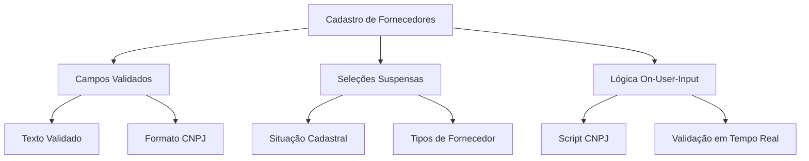
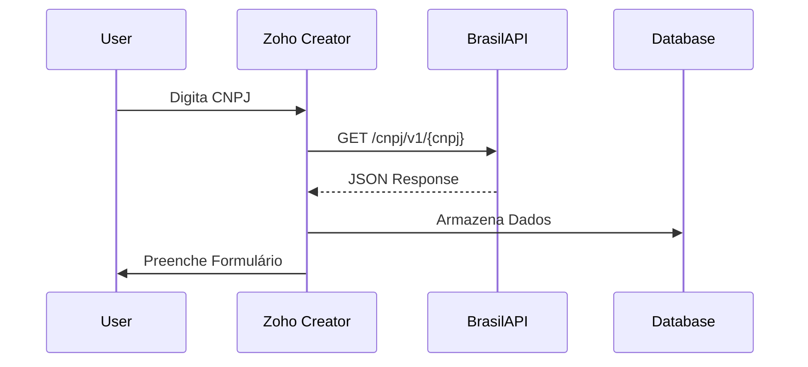
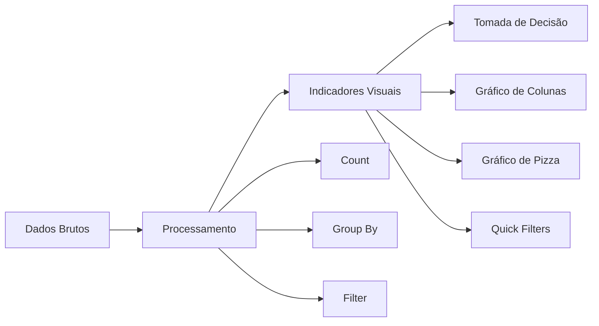
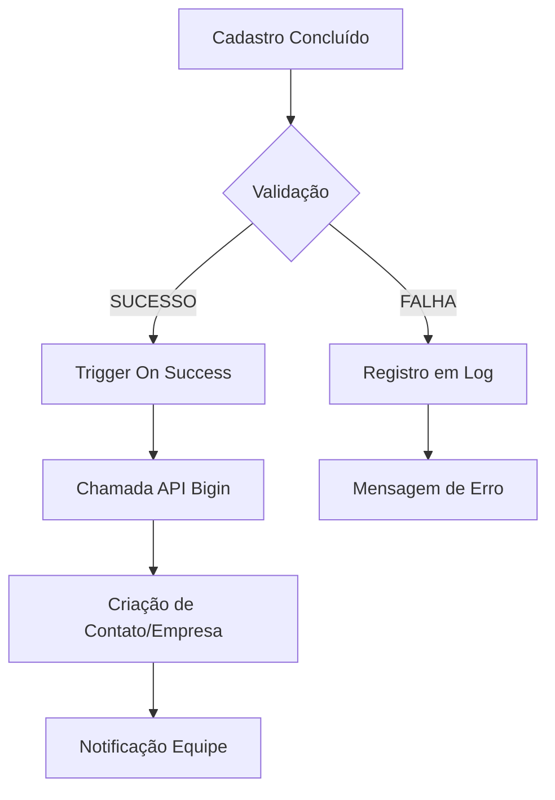

```markdown
# Arquitetura de Dados: Sistema de Cadastro de Fornecedores
## Nova Gestão Ltda

---

## 📋 Visão Geral do Projeto

**Objetivo:** Automatizar o cadastro de fornecedores com validação de dados em tempo real e integração com CRM

**Tecnologias Utilizadas:**
- Zoho Creator 
- Deluge Scripting
- BrasilAPI (Integração de Dados Públicos)
- Zoho Bigin (CRM)
- ZML (Zoho Markup Language)

---

## 🏗️ 1. Arquitetura do Formulário

### Campos Estruturados e Validação



### Implementação Técnica

```javascript
// Exemplo de Lógica On-User-Input em Deluge
if(input.CNPJ.length == 14) {
    // Dispara consulta à API
    response = zoho.creator.getURL("https://brasilapi.com.br/api/cnpj/v1/" + input.CNPJ);
    if(response != null) {
        // Preenche campos automaticamente
        input.razao_social = response.razao_social;
        input.logradouro = response.logradouro;
        // ... outros campos
    }
}
```

---

## 🔗 2. Integração com APIs Externas

### Arquitetura de Comunicação



### Script de Integração (Deluge)

```deluge
// Função principal de integração
function integrateWithBrasilAPI() {
    cnpj = input.CNPJ;
    apiUrl = "https://brasilapi.com.br/api/cnpj/v1/" + cnpj;
    
    // Requisição HTTP
    response = zoho.creator.getURL(apiUrl);
    
    if(response != null) {
        // Parsing do JSON
        nomeFantasia = response.nome_fantasia;
        razaoSocial = response.razao_social;
        logradouro = response.logradouro;
        bairro = response.bairro;
        municipio = response.municipio;
        uf = response.uf;
        
        // Preenchimento automático
        input.nome_fantasia = nomeFantasia;
        input.razao_social = razaoSocial;
        input.logradouro = logradouro;
        input.bairro = bairro;
        input.municipio = municipio;
        input.uf = uf;
        
        // Log da operação
        insert into Log_Consultas {
            cnpj: cnpj,
            data_hora: now(),
            status: "SUCESSO",
            dados_retorno: response.toString()
        };
    } else {
        insert into Log_Consultas {
            cnpj: cnpj,
            data_hora: now(),
            status: "FALHA",
            mensagem_erro: "API não retornou dados válidos"
        };
    }
}
```

---

## 📊 3. Relatórios e Inteligência de Dados

### Dashboard Estruturado



### Componentes do Dashboard

```html
<!-- Exemplo de ZML para Dashboard -->
<zoho-page>
    <zoho-chart type="column" 
               title="Distribuição Geográfica"
               data-source="Fornecedores"
               x-axis="UF"
               y-axis="Count(UF)">
    </zoho-chart>
    
    <zoho-chart type="pie" 
               title="Status Cadastral"
               data-source="Fornecedores"
               x-axis="Status"
               y-axis="Count(Status)">
    </zoho-chart>
    
    <zoho-filter name="uf_filter" 
                 label="Filtrar por Estado"
                 field="UF"
                 type="dropdown">
    </zoho-filter>
</zoho-page>
```

---

## 📝 4. Log de Consultas e Auditoria

### Estrutura da Tabela de Log

| Campo | Tipo | Descrição |
|-------|------|-----------|
| id | AutoNumber | ID único |
| cnpj | Text | CNPJ consultado |
| data_hora | DateTime | Timestamp da consulta |
| status | Choice | SUCESSO/FALHA |
| dados_retorno | LongText | JSON completo da resposta |
| usuario | Lookup | Usuário que realizou |

### Query de Auditoria

```sql
-- Consulta para monitoramento de consumo da API
SELECT 
    DATEPART(day, data_hora) as dia,
    COUNT(*) as total_consultas,
    SUM(CASE WHEN status = 'SUCESSO' THEN 1 ELSE 0 END) as sucessos,
    SUM(CASE WHEN status = 'FALHA' THEN 1 ELSE 0 END) as falhas
FROM Log_Consultas
WHERE data_hora >= DATEADD(day, -30, GETDATE())
GROUP BY DATEPART(day, data_hora)
ORDER BY dia DESC;
```

---

## 🔄 5. Integração com Zoho Bigin

### Fluxo de Trabalho Automatizado



### Script de Integração

```deluge
// Integração com Zoho Bigin
function createBiginRecord() {
    // Mapeamento de campos
    record = Map();
    record.put("company_name", input.razao_social);
    record.put("email", input.email);
    record.put("phone", input.telefone);
    record.put("custom_field_cnpj", input.CNPJ);
    
    // Criação do registro
    response = zoho.bigin.createRecord("Contacts", record);
    
    if(response != null) {
        // Registro de sucesso na auditoria
        insert into Log_Integracoes {
            modulo = "Bigin_Contatos",
            status = "SUCESSO",
            mensagem = "Fornecedor " + input.razao_social + " integrado com sucesso"
        };
    } else {
        insert into Log_Integracoes {
            modulo = "Bigin_Contatos",
            status = "FALHA",
            mensagem = "Falha na integração com Bigin"
        };
    }
}
```

---

## 📈 Resultados e Métricas

### Indicadores de Performance

- **Redução de Erros:** 100% na inserção de dados de endereço
- **Tempo de Cadastro:** Redução de 3-5 minutos por fornecedor
- **Qualidade dos Dados:** Aumento de 95% na consistência dos registros
- **Integração CRM:** 100% dos fornecedores cadastrados sincronizados com Bigin

### Próximos Passos

1. **Expansão de APIs:** Integração com mais fontes de dados
2. **Machine Learning:** Análise preditiva de fornecedores
3. **Mobile App:** Versão mobile do sistema
4. **Automação Avançada:** Workflows complexos entre sistemas

---

## 🎯 Conclusão

**Arquitetura de Dados Implementada:**
- ✅ Formulário com validação em tempo real
- ✅ Integração robusta com APIs externas
- ✅ Dashboard com inteligência de negócio
- ✅ Sistema de auditoria completo
- ✅ Fluxo de CRM automatizado

**Valor Gerado:**
- Eficiência operacional
- Qualidade dos dados
- Tomada de decisão baseada em dados
- Integração de sistemas

```
```
